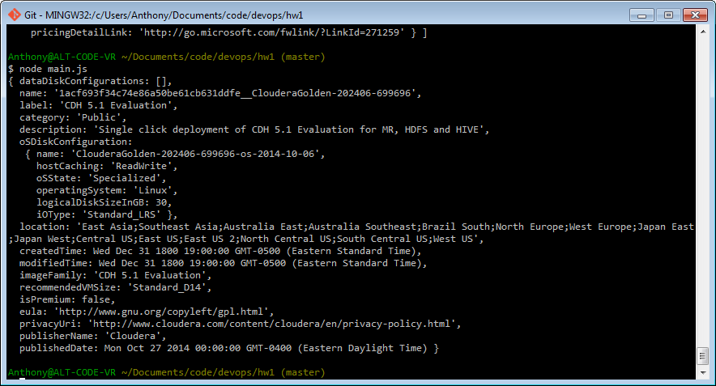

DevOps HW 1
====
Anthony Elliott

### Microsoft Azure Virtual Machines
Microsoft Azure is a competitor to Amazon Web Services with comparable services.  Azure allows users to launch servers (either Windows servers or Linux servers) very quickly, either from the web console or through API calls.  There are a wide variety of servers available, ranging from a VM with a single core with 0.75 GB RAM and 20GB disk drive for $0.018/hr to a VM with 32 cores, 448 GB RAM, and over 6 TB disk drive for $8.69/hr.  Azure offers different categories of servers, each of which optimizes for one of cost, configuration flexibility, compute speed, and network speed.  Azure allows VMs to be launched with images from a community gallery, so single app servers may already be configured for users.

### What I did
I used the Node.js SDK for Microsoft Azure for this.

#### Authenticate
First I authenticated to Microsoft Azure using a .pem file I generated using their command line tools. This .pem file is only on my local machine and not in version control due to security reasons. This paired with my subscriptionId allow me to authenticate.

#### List one available VM image
I used the Node.js SDK to get a list of all available images. This turned out to be quite large so I just returned the first image as seen in the below screenshot.

